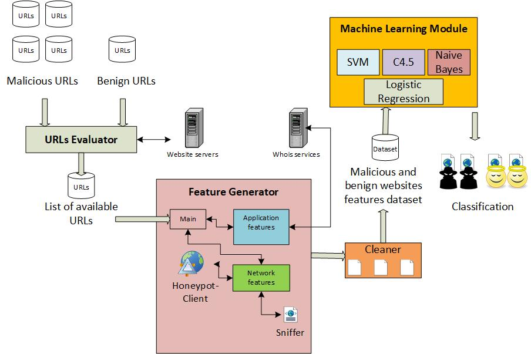

# 用于检测恶意网站的机器学习方法

# 数据集介绍
本文采用的数据集为Kaggle上的[Malicious and Benign Websites](https://www.kaggle.com/xwolf12/malicious-and-benign-websites/home)数据集，如图所示，首先，他们从其他文献或是网站上收集了一系列良性/恶意网站的URL，接着又使用了蜜罐客户端（浏览器）以及其他工具（whois、tcpdump）通过URL来获取良性/恶意网站的信息，这些信息包括了应用层特征（Application Features）和网络层特征（Network Features）[^datasets]。

应用层特征有：

- URL: it is the anonimous identification of the URL analyzed in the study # 网站URL(非真实URL)
- URL_LENGTH: it is the number of characters in the URL # URL长度
- NUMBER_SPECIAL_CHARACTERS: it is number of special characters identified in the URL, such as, “/”, “%”, “#”, “&”, “. “, “=” # URL中包含特殊字符的个数
- CHARSET: it is a categorical value and its meaning is the character encoding standard (also called character set). # 编码
- SERVER: it is a categorical value and its meaning is the operative system of the server got from the packet response. # 服务器类型&版本
- CONTENT_LENGTH: it represents the content size of the HTTP header.  #HTTP报头长度
- WHOIS_COUNTRY: it is a categorical variable, its values are the countries we got from the server response (specifically, our script used the API of Whois). #服务器地理位置
- WHOIS_STATEPRO: it is a categorical variable, its values are the states we got from the server response (specifically, our script used the API of Whois). #服务器所在的洲/省
- WHOIS_REGDATE: Whois provides the server registration date, so, this variable has date values with format DD/MM/YYY HH:MM # 域名注册的日期
- WHOIS_UPDATED_DATE: Through the Whois we got the last update date from the server analyzed #域名更新的日期

网络层特征有：
- TCP_CONVERSATION_EXCHANGE: This variable is the number of TCP packets exchanged between the server and our honeypot client # 服务器与我们的蜜罐客户端的tcp连接包个数
- DIST_REMOTE_TCP_PORT: it is the number of the ports detected and different to TCP #
- REMOTE_IPS: this variable has the total number of IPs connected to the honeypot #连接到蜜罐的IP地址个数
- APP_BYTES: this is the number of bytes transfered #整个通讯中的网络流量
- SOURCE_APP_PACKETS: packets sent from the honeypot to the server #从蜜罐发送至服务器的包个数
- REMOTE_APP_PACKETS: packets received from the server # 服务器发送至蜜罐的包个数
- APP_PACKETS: this is the total number of IP packets generated during the communication between the honeypot and the server # 整个通讯中的IP包个数
- DNS_QUERY_TIMES: this is the number of DNS packets generated during the communication between the honeypot and the server #DNS包的个数
- TYPE: this is a categorical variable, its values represent the type of web page analyzed, specifically, 1 is for malicious websites and 0 is for benign websites #是否为恶意网站

# 数据预处理

## 字符串类型

属于字符串类型的属性有CHARSET、SERVER、WHOIS_COUNTRY、WHOIS_STATEPRO、WHOIS_REGDATE、WHOIS_UPDATED_DATE，对于这类属性的预处理步骤如下：

空值处理：将空值设为“Unknown”

数据不一致问题：经过归类后会发现，一个相同含义的属性会有不同的值，比如COUNTRY字段中，英国被表示成“UK”和“United Kingdom”，在预处理时需要将这些值替换成统一的值。

OneHot：将字符串类型转换为id代表的数值类型

## 数值类型

属于数值类型的属性有：DIST_REMOTE_TCP_PORT、REMOTE_IPS、APP_BYTES、SOURCE_APP_PACKETS、REMOTE_APP_PACKETS、APP_PACKETS、DNS_QUERY_TIMES、CONTENT_LENGTH，对于这类属性的预处理步骤有：

空值处理：将空值使用平均值替换

## 时间戳类型

属于时间戳类型的属性有：WHOIS_REGDATE、WHOIS_UPDATED_DATE，首先将他们按格式转换为数值类型，再应用数值类型的处理步骤。

## SERVER属性

SERVER属性属于字符串类型，但是由于它的记录存在多种格式，比如nginx存在的记录格式有：nginx，nginx/1.12.0，cloudflare-nginx，为了统一，尽管服务器的版本是一个很重要的信息，但是由于更多的记录不存在版本，我们只保留server类型而忽略版本信息。

# 机器学习算法和评估
## 准确性

我们分别使用应用层，网络层的属性以及所有属性的混合作为输入数据，使用随机森林（RF）、朴素贝叶斯（NB）、支持向量机（SVM）、神经网络（NN）四种分类算法进行实验，并且采用十折交叉验证分类的准确性，度量标准为准确率（Precision）、召回率（Recall）和F1。实验结果如下：

|        | Mix       |          |          | Application |          |          | Network   |          |          |
| ------ | --------- | -------- | -------- | ----------- | -------- | -------- | --------- | -------- | -------- |
| Alg    | Precision | Recall   | F1       | Precision   | Recall   | F1       | Precision | Recall   | F1       |
| **RF** | **0.82**  | **0.64** | **0.65** | **0.83**    | **0.60** | **0.58** | **0.81**  | **0.65** | **0.69** |
| NB     | 0.16      | 0.89     | 0.24     | 0.35        | 0.27     | 0.30     | 0.14      | 0.95     | 0.25     |
| SVM    | 0.4       | 0.08     | 0.12     | 0.40        | 0.12     | 0.17     | 0.83      | 0.42     | 0.51     |
| NN     | 0.30      | 0.19     | 0.23     | 0.33        | 0.18     | 0.23     | 0.15      | 0.04     | 0.06     |

可以看到，在三个属性组中随机森林的效果最好，朴素贝叶斯表现不好的原因是因为属性之间可能存在相关性，例如，URL长度与URL中特殊字符数目有关（经过计算，我们的确发现URL长度与URL中特殊字符数目的皮尔逊相关系数很高），支持向量机表现不好的原因是因为样本类别存在严重的数据倾斜问题（数据集中存在1565个良性网站记录和216个恶意网站记录），对于神经网络来说，最大的威胁来自于数据量较小。有趣的是，除了神经网络，其他算法在使用部分属性（应用层属性或网络层属性）时，准确率比使用所有属性的准确率高，这说明了在数据挖掘过程中使用所有属性进行分类的效果不一定比使用更具特征的一类属性的效果好。

## 耗时

以下为四类算法的耗时研究，为方便起见，这里一种方法的耗时包括了一次算法训练时间加一次效果评估的时间，因此该数值仅具有比较意义，四类算法均运行在硬件环境为Intel i5-7300U（2.60Ghz）、8GB RAM、256GB SSD，软件环境为Windows 10 Home 1803，Python 2.7.15、scikit-learn == 0.19.1的主机上。

| Alg  | Mix   | Application | Network |
| ---- | ----- | ----------- | ------- |
| RF   | 40ms  | 42ms        | 38ms    |
| NB   | 8ms   | 5ms         | 5ms     |
| SVM  | 245ms | 174ms       | 122ms   |
| NN   | 45ms  | 41ms        | 835ms   |

横向对比可以发现，RF和NB的时间变化对于属性数量不敏感，而SVM的耗时与属性数量呈正相关，对于神经网络的Mix属性组和Application属性组来说，由于每次迭代的优化速度小于容忍度（0.000001）因此算法提前终止，因此不具有参考价值。

纵向对比可以发现，NB的耗时最短，因为它的算法较为简单，其次是RF，NN的耗时最长，因为它需要多次迭代，这也是神经网络的缺点之一。

[^datasets]: Urcuqui, C., Navarro, A., Osorio, J., & Garcıa, M. (2017). Machine Learning Classifiers to Detect Malicious Websites. CEUR Workshop Proceedings. Vol 1950, 14-17.